# Tienda Sakura – Gestión de Productos con Django y PostgreSQL  

Aplicación web desarrollada como parte de la **Evaluación del Módulo 7** (Talento Digital).  
Permite gestionar productos, categorías y etiquetas con un sistema CRUD completo, utilizando el ORM de Django y conexión a **PostgreSQL**.  

---

## Descripción general  

La aplicación gestiona una tienda temática de anime donde se administran **productos, categorías y etiquetas**.  
Incluye relaciones:  
- **Muchos a Uno** → `Producto → Categoria`  
- **Muchos a Muchos** → `Producto ↔ Etiqueta`  
- **Uno a Uno** → `Producto → DetalleProductos` (dimensiones y peso)  

---

## Instalación  

```bash
git clone https://github.com/tuusuario/tienda-sakura.git
cd aplicacion
python -m venv myenv
myenv\Scripts\activate
pip install django psycopg2-binary
python manage.py migrate
python manage.py createsuperuser
python manage.py runserver
```

Accede a:
- http://127.0.0.1:8000 → aplicación  
- http://127.0.0.1:8000/admin → panel de administración  

---

## 🖼️ Interfaz del sistema

## 🖥️ Interfaz del Sistema

| Vista | Descripción | Imagen |
|--------|--------------|--------|
| **Inicio** | Menú principal de navegación | 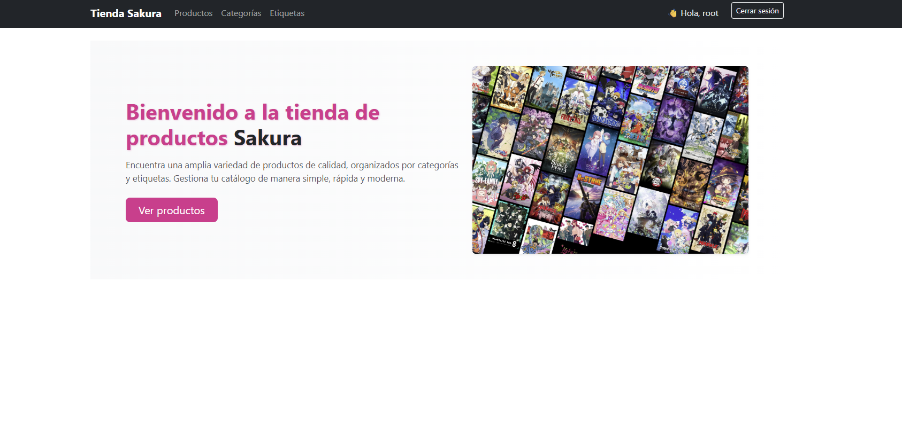 |
| **Lista de productos** | Tabla con acciones CRUD | 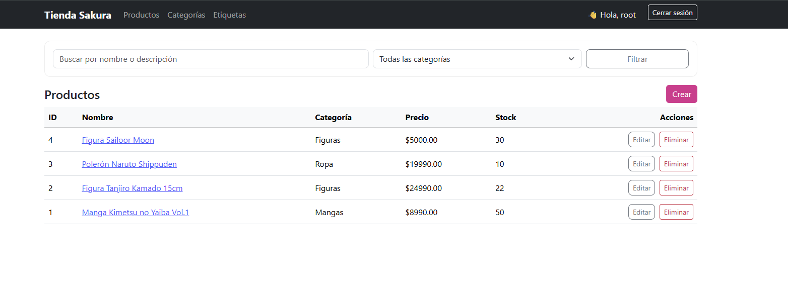 |
| **Crear producto** | Formulario de creación | 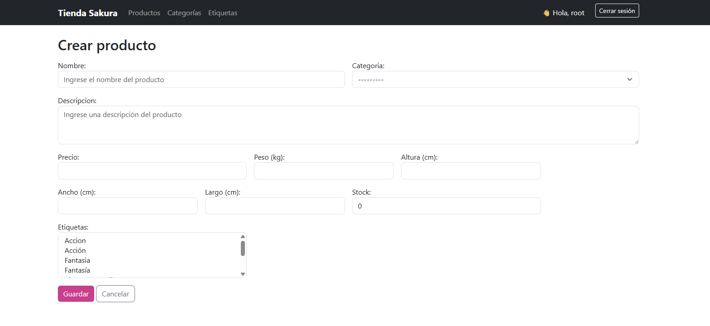 |
| **Detalle de producto** | Información completa | 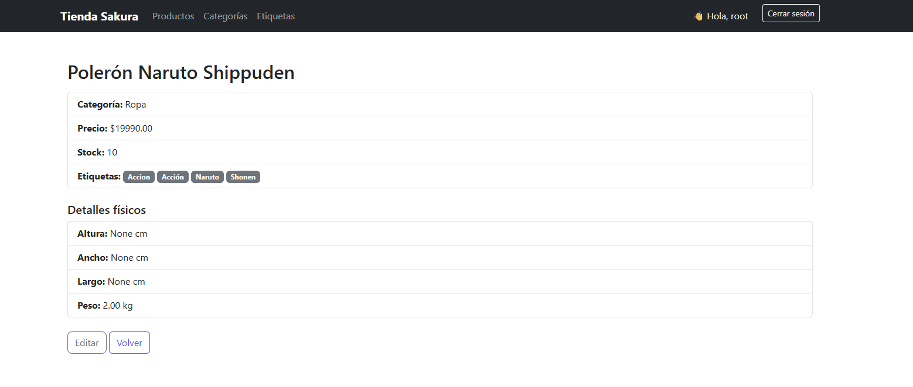 |
| **Editar producto** | Formulario precargado | 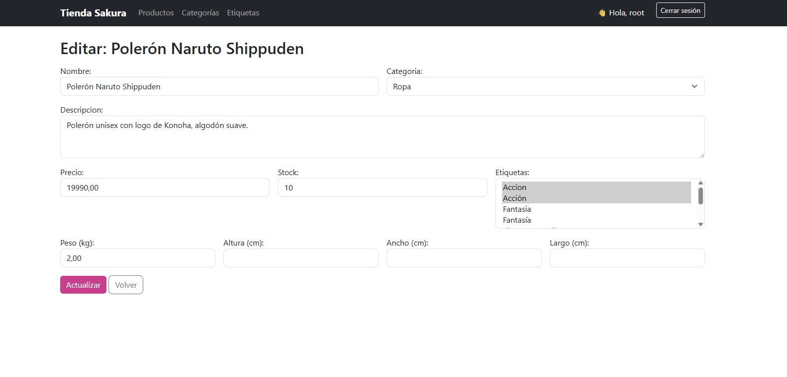 |
| **Eliminar producto** | Confirmación de borrado | 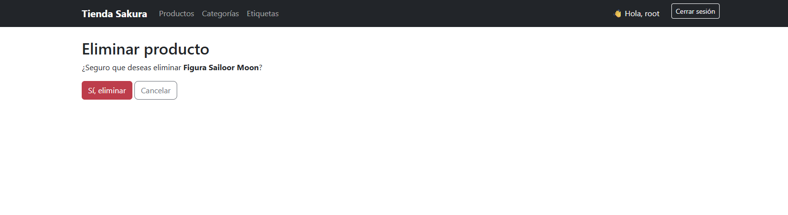 |
| **Categorías** | CRUD de categorías | 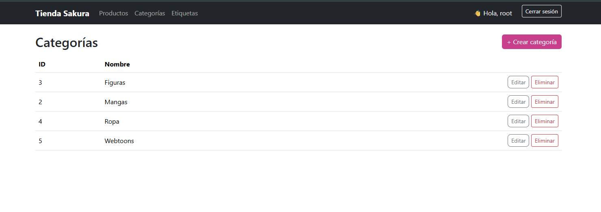 |
| **Etiquetas** | CRUD de etiquetas | 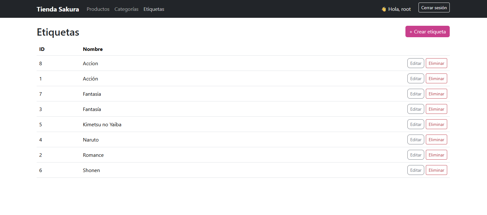 |
| **Login** | Vista de inicio de sesión | 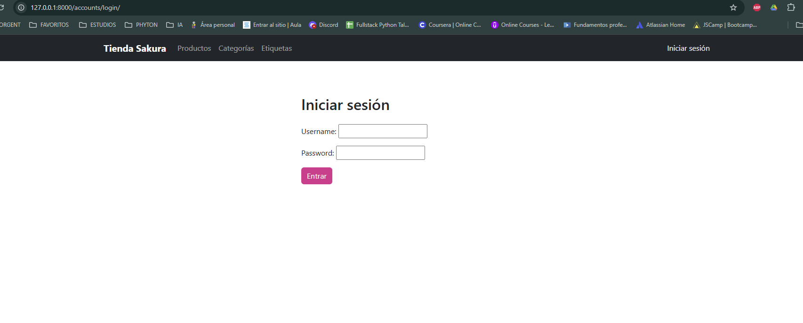 |


## Modelos principales  

```python
class Categoria(models.Model):
    nombre = models.CharField(max_length=255, unique=True)

class Etiqueta(models.Model):
    nombre = models.CharField(max_length=255, unique=True)

class Producto(models.Model):
    nombre = models.CharField(max_length=255)
    descripcion = models.TextField()
    precio = models.DecimalField(max_digits=10, decimal_places=2)
    stock = models.PositiveIntegerField(default=0)
    categoria = models.ForeignKey(Categoria, on_delete=models.PROTECT, related_name='productos')
    etiquetas = models.ManyToManyField(Etiqueta, related_name='productos', blank=True)

class DetalleProductos(models.Model):
    producto = models.OneToOneField(Producto, on_delete=models.CASCADE, related_name='detalle')
    peso_kg = models.DecimalField(max_digits=6, decimal_places=2, null=True, blank=True)
    alto_cm = models.DecimalField(max_digits=6, decimal_places=2, null=True, blank=True)
    ancho_cm = models.DecimalField(max_digits=6, decimal_places=2, null=True, blank=True)
    largo_cm = models.DecimalField(max_digits=6, decimal_places=2, null=True, blank=True)
```

---

## Consultas ORM realizadas  

Ejecutadas desde la shell de Django (`python manage.py shell`) utilizando `filter()`, `exclude()`, `annotate()` y `Q()`.  

### Búsquedas básicas
```python
# Por nombre (case-insensitive)
Producto.objects.filter(nombre__icontains="naruto")

# Por categoría
cat = Categoria.objects.get(nombre="Mangas")
Producto.objects.filter(categoria=cat)

# Por nombre o descripción
from django.db.models import Q
Producto.objects.filter(Q(nombre__icontains="tanjiro") | Q(descripcion__icontains="demon"))
```
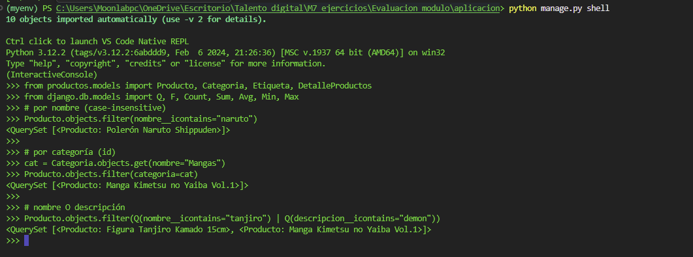

### Comparaciones y orden
```python
# Mayores a un valor
Producto.objects.filter(precio__gt=15000)

# Rango de precios
Producto.objects.filter(precio__gte=8000, precio__lte=25000)

# Ordenar
Producto.objects.order_by("-precio", "nombre")[:5]
```
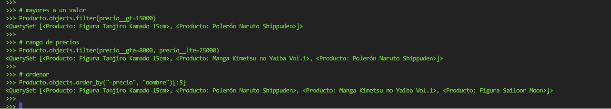

### Relaciones Muchos-a-Muchos
```python
shonen = Etiqueta.objects.get(nombre="Shonen")

# Productos con una etiqueta específica
Producto.objects.filter(etiquetas=shonen).distinct()

# Productos con varias etiquetas (que tengan TODAS)
Producto.objects.filter(etiquetas__in=[shonen]).distinct()

# Productos que tengan al menos UNA etiqueta
Producto.objects.filter(etiquetas__in=[shonen, fantasia]).distinct()
```
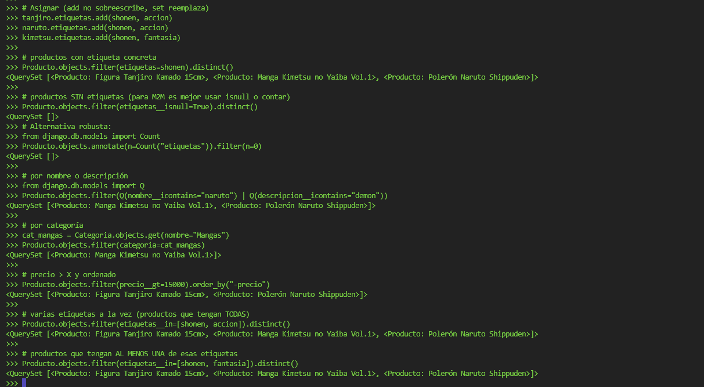

### Consultas con exclude()
```python
# Excluir rango de precios
Producto.objects.exclude(precio__gte=8000, precio__lte=25000)

# Excluir nulos (sin descripción)
Producto.objects.exclude(descripcion__isnull=True).exclude(descripcion__exact="")

# Combinar filter + exclude
Producto.objects.filter(categoria=cat).exclude(nombre__icontains="edición limitada")

# Excluir varias categorías
Producto.objects.exclude(categoria__nombre__in=["Posters", "Accesorios"])
```
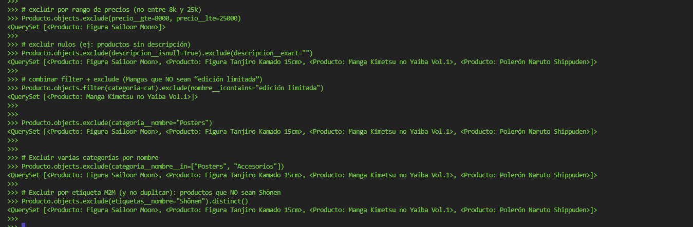

###  Combinaciones con Q() y condiciones lógicas
```python
from django.db.models import Q
Producto.objects.filter(
    Q(nombre__icontains="tanjiro") | Q(descripcion__icontains="demon"),
    precio__gt=10000
)
```
.png)

### Consultas con anotaciones y agregaciones
```python
from django.db.models import Count, Avg, Min, Max

# Total de productos por categoría
Producto.objects.values("categoria__nombre").annotate(total=Count("id")).order_by("-total")

# Promedio, mínimo y máximo por categoría
Producto.objects.values("categoria__nombre").annotate(
    prom=Avg("precio"),
    minimo=Min("precio"),
    maximo=Max("precio")
)
```


---

## Seguridad

- Formularios protegidos con ``  
- Vistas con `@login_required`  
- Middleware de seguridad activado  
- Django Admin habilitado para gestión de modelos  

---

## Rutas principales  

```python
urlpatterns = [
    path('', views.index, name='index'),
    path('productos/', views.lista_productos, name='lista_productos'),
    path('productos/crear/', views.crear_producto, name='crear_producto'),
    path('productos/<int:id>/', views.detalle_producto, name='detalle_producto'),
    path('productos/<int:id>/editar/', views.editar_producto, name='editar_producto'),
    path('productos/<int:id>/eliminar/', views.eliminar_producto, name='eliminar_producto'),
    path('categorias/', views.lista_categorias, name='lista_categorias'),
    path('etiquetas/', views.lista_etiquetas, name='lista_etiquetas'),
]
```

---

## Licencia

Proyecto académico — Catalina Villegas — Talento Digital 2025.
